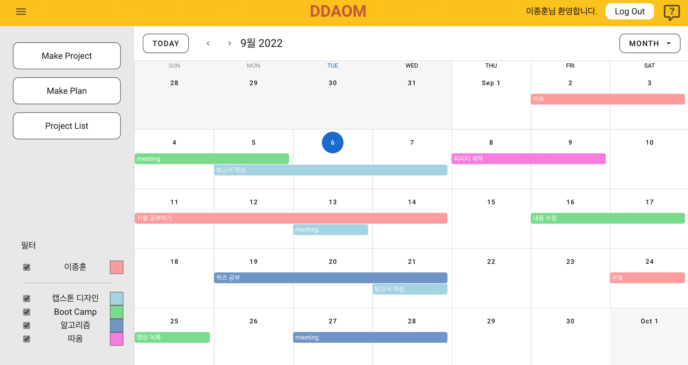

# DDAOM

> `따옴`은 효과적인 일정 관리를 위한 스케줄 관리 사이트입니다. 개인 일정부터 프로젝트까지, 끝까지 완주할 수 있도록 도와드려요!

`따옴` 은 팀 프로젝트를 자주 진행하는 대학생들이 모여, “ 자신의 일정과 팀 일정을 함께 관리하자! ”라는 작은 아이디어로부터 시작돼 만들어진 웹 소프트웨어입니다. 팀 프로젝트가 아니더라도 동아리, 여행 등 공유하고 싶은 대상을 추가하여 그 대상과 함께 일정을 공유할 수 있습니다.

## 소개 영상

- [프로젝트 소개 영상](https://youtu.be/gWHTH-L3urU)
- [서비스 구동 영상](https://youtu.be/UKXYObs00Q4)

## 사용법

해당 레포지토리를 git clone한 후, `frontend` 폴더에서 `npm run start`, `backend` 폴더에서 `node index.js` 명령어를 통해 실행한다.

- 따로 서버용 데이터베이스가 구축되어있지 않아, 로컬 데이터베이스 연결 후 구동해주시기 바랍니다.

## wiki page

따옴에 대해 더 자세히 알고 싶다면, 다음 [wiki page](https://royal-tiger-88d.notion.site/DDAOM-5841b3ff9a9b48fa8ee038357f722abf)를 참고해주시길 바랍니다.

- [따옴 제작 과정 page](https://royal-tiger-88d.notion.site/DDAOM-ffbbdf130e1f41beb42c1674cb91fc25)
